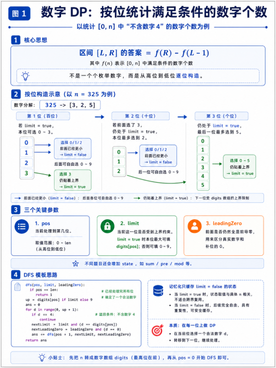

# 数位DP

## 一、数位DP 是什么？

`数位DP`，全称可以理解为：

> 在数字的每一位上做 `动态规划`。

它通常用来解决这类问题：

> 给你一个范围 `[L, R]`，问这个范围内有多少个数字满足某种条件。

比如：

- `[1, 1000]` 中有多少个数不包含数字 `4`
- `[1, n]` 中有多少个数的各位数字之和等于 `k`
- `[1, n]` 中有多少个数相邻两位数字不相同
- `[L, R]` 中有多少个数是“数位递增”的
- `[L, R]` 中有多少个数满足某种取模条件

一句话记忆：

==数位DP 本质上是在“按位构造数字”，并统计满足条件的数字个数。==

------

## 二、为什么需要数位DP？

假设题目问：

> 求 [1, $10^{18}$]中有多少个数不包含数字 `4`

如果暴力枚举：

```text
1, 2, 3, 4, 5, ..., 10^18
```

这是完全不可能的，数量级太大，必定超时。

但是一个数字最多只有 `19` 位。

比如：

```text
$10^{18}$ = 1000000000000000000
```

**它虽然很大，但是位数不多。**

所以数位DP 的核心思想就是：

==不要一个数一个数枚举，而是一位一位地枚举。==

例如对于数字 `325`，我们可以从高位到低位构造：

```text
第 1 位：0 ~ 3
第 2 位：0 ~ 9
第 3 位：0 ~ 9
```

但是这里有个问题：

如果第一位选了 `3`，第二位就不能超过 `2`。

如果前两位选了 `32`，第三位就不能超过 `5`。

所以数位DP 需要处理一个非常重要的问题：

==当前这一位能不能随便选，还是必须受到上界限制？==

这就是数位DP 中最核心的参数：`limit`。

------

## 三、数位DP 的基本套路

一般数位DP 不直接求 `[L, R]`，而是先写一个函数：

```java
f(n)
```

表示：

```text
统计 [0, n] 中满足条件的数字个数
```

那么：

```text
[L, R] 中满足条件的个数 = f(R) - f(L - 1)
```

例如：

```text
求 [10, 100] 中不含 4 的数字个数

答案 = f(100) - f(9)
```

所以**数位DP 的标准套路**是：

```text
1. 写一个函数 f(n)，统计 [0, n] 的答案
2. 把 n 拆成数字数组
3. 从最高位开始 dfs
4. 用记忆化搜索优化重复状态
5. 最后用 f(R) - f(L - 1) 得到区间答案
```

------

## 四、数位DP 的几个核心参数

数位DP 最常见的递归函数长这样：

```java
dfs(pos, limit, leadingZero, state)
```

其中每个参数都有固定含义。

------

### 4.1 `pos`：当前处理到第几位

`pos` 表示当前正在填第几位数字。

假设数字是：

```text
325
```

我们把它拆成数组：

```text
digits = [3, 2, 5]
```

那么：

```text
pos = 0 表示正在填百位
pos = 1 表示正在填十位
pos = 2 表示正在填个位
pos = 3 表示所有位都填完了
```

所以递归终止条件通常是：

```java
if (pos == digits.length) {
    return 条件是否满足 ? 1 : 0;
}
```

------

### 4.2 `limit`：当前是否受到上界限制

`limit` 是数位DP 中最重要的参数。

它表示：

> 当前这一位能不能随便填 `0 ~ 9`。

如果 `limit == true`，说明前面填的数字和上界完全一样，所以当前位不能超过上界对应的那一位。

如果 `limit == false`，说明前面已经比上界小了，所以后面的位可以随便填 `0 ~ 9`。

举个例子：

```text
n = 325
```

我们从左到右构造数字。

如果第一位填 `3`：

```text
3 _ _
```

前面和 `325` 一样，所以第二位最多只能填 `2`。

此时：

```java
limit = true
```

如果第一位填 `2`：

```text
2 _ _
```

这个数字已经小于 `325` 了，所以后面两位可以随便填：

```text
200 ~ 299
```

此时：

```java
limit = false
```

所以当前位最大值一般这样写：

```java
int up = limit ? digits[pos] : 9;
```

------

### 4.3 `leadingZero`：是否还在前导零阶段

`leadingZero` 表示：

> 到目前为止，前面是不是还没有填过真正的数字。

为什么需要这个参数？

因为我们经常会把所有数字统一看成和 `n` 一样长。

比如 `n = 325`，我们统计 `[0, 325]`。

数字 `7` 可以看成：

```text
007
```

数字 `25` 可以看成：

```text
025
```

这里前面的 `0` 就是 `前导零`。

但是前导零不应该当成真实数字参与判断。

比如题目要求“不包含数字 0”，那么数字 `7` 写成 `007` 时，前面的两个 `0` 不应该让它变成非法。

所以需要 `leadingZero` 来区分：

```text
当前的 0 是前导零，还是数字本身的一部分？
```

常见写法：

```java
boolean nextLeadingZero = leadingZero && d == 0;
```

意思是：

```text
如果之前还在前导零阶段，并且当前位也填 0
那么下一位仍然处于前导零阶段
```

------

### 4.4 `state`：题目要求维护的信息

`state` 不是固定的，它取决于题目条件。

比如：

#### 情况一：统计不含数字 `4`

只需要知道当前数字有没有出现过 `4`。

甚至可以在枚举时直接跳过 `4`，不额外设计复杂状态。

#### 情况二：统计各位数字之和等于 `k`

需要维护：

```java
sum
```

表示当前已经选过的数字之和。

递归函数可以写成：

```java
dfs(pos, sum, limit, leadingZero)
```

#### 情况三：统计相邻数字不相同

需要维护：

```java
pre
```

表示上一位数字是多少。

递归函数可以写成：

```java
dfs(pos, pre, limit, leadingZero)
```

#### 情况四：统计数字能被 `m` 整除

需要维护：

```java
mod
```

表示当前构造出来的数字对 `m` 取模的结果。

递归函数可以写成：

```java
dfs(pos, mod, limit, leadingZero)
```

一句话总结：

==`state` 就是题目中“影响后续选择”的信息。==

------

## 五、数位DP 的基本模板

下面是一个最常见的数位DP 模板。

它统计的是：

> `[0, n]` 中满足某种条件的数字个数。

```java
import java.util.Arrays;

class DigitDP {
    // digits[i] 表示数字 n 从高位到低位的第 i 位
    // 例如 n = 325，则 digits = [3, 2, 5]
    int[] digits;

    // memo[pos][state] 用来做记忆化搜索
    // 表示：当前处理到 pos 位置，并且当前状态是 state 时，后面能构造出的合法数字个数
    long[][] memo;

    /**
     * 统计 [0, n] 中满足条件的数字个数
     */
    public long count(long n) {
        // 如果 n < 0，说明区间为空，直接返回 0
        // 这个处理主要是为了方便计算 f(R) - f(L - 1)
        if (n < 0) {
            return 0;
        }

        // 把数字 n 转成字符串，再拆成每一位
        // 例如：325 -> "325" -> ['3', '2', '5']
        char[] s = Long.toString(n).toCharArray();

        // 创建 digits 数组，用来保存 n 的每一位数字
        digits = new int[s.length];

        // 把字符数字转成真正的整数数字
        // '3' - '0' = 3
        for (int i = 0; i < s.length; i++) {
            digits[i] = s[i] - '0';
        }

        // memo 的第二维大小要根据题目的 state 来设计
        // 比如：
        // 1. 如果 state 是数位和 sum，最大可能是 9 * 位数
        // 2. 如果 state 是上一位数字 pre，可以开 11，表示 0~9 和“没有上一位”
        // 3. 如果 state 是 mod，可以开 m
        memo = new long[digits.length][具体状态大小];

        // 初始化 memo，-1 表示这个状态还没有计算过
        for (int i = 0; i < digits.length; i++) {
            Arrays.fill(memo[i], -1);
        }

        // 从第 0 位开始搜索
        // 初始时：
        // pos = 0：从最高位开始处理
        // state = 初始状态：根据题目决定
        // limit = true：一开始一定受到 n 的限制
        // leadingZero = true：一开始还没有填过真实数字，处于前导零阶段
        return dfs(0, 初始状态, true, true);
    }

    /**
     * 数字 DP 的核心递归函数
     *
     * @param pos 当前处理到第几位
     * @param state 当前状态，具体含义由题目决定
     * @param limit 当前这一位是否受到上界 n 的限制
     * @param leadingZero 当前是否还处于前导零阶段
     * @return 从当前状态继续往后填，能构造出的合法数字个数
     */
    private long dfs(int pos, int state, boolean limit, boolean leadingZero) {
        // 如果 pos == digits.length，说明所有数位都已经填完了
        if (pos == digits.length) {
            // 如果当前构造出的数字满足题目条件，就贡献 1 个答案
            // 否则贡献 0 个答案
            return 满足条件 ? 1 : 0;
        }

        // 记忆化搜索：
        // 只有在不受上界限制，并且已经不是前导零时，才可以使用缓存
        //
        // 为什么要求 !limit？
        // 因为 limit == true 时，当前状态和具体上界 n 有关，不能随便复用
        //
        // 为什么通常要求 !leadingZero？
        // 因为前导零阶段有时会影响 state 的含义，为了避免混乱，常见模板中不缓存前导零状态
        if (!limit && !leadingZero && memo[pos][state] != -1) {
            return memo[pos][state];
        }

        // 当前这一位最多能填到多少
        // 如果 limit == true，说明前面仍然贴着上界走，所以当前位最多只能填 digits[pos]
        // 如果 limit == false，说明前面已经小于上界了，所以当前位可以随便填 0~9
        int up = limit ? digits[pos] : 9;

        // ans 用来统计当前状态下的答案总数
        long ans = 0;

        // 枚举当前这一位要填的数字 d
        for (int d = 0; d <= up; d++) {
            // 判断下一位是否仍然受到上界限制
            //
            // 只有当前本来就受到限制 limit == true，
            // 并且当前位 d 也刚好填到了上界 digits[pos]，
            // 下一位才继续受到限制
            boolean nextLimit = limit && d == up;

            // 判断下一位是否仍然处于前导零阶段
            //
            // 如果之前还没开始填真实数字，并且当前位继续填 0，
            // 那么下一位仍然是前导零阶段
            boolean nextLeadingZero = leadingZero && d == 0;

            // 如果当前仍然是前导零
            if (nextLeadingZero) {
                // 前导零通常不算作真实数字
                // 所以很多题目中，这里不会更新 state
                //
                // 例如：
                // 数字 7 可以看成 007
                // 前面的两个 0 不应该影响“是否包含 0”“相邻数字是否相同”等判断
                ans += dfs(pos + 1, 新状态, nextLimit, true);
            } else {
                // 当前位 d 是真实数字，需要根据题目判断是否合法
                //
                // 例如：
                // 1. 如果题目要求不包含数字 4，那么 d == 4 就不合法
                // 2. 如果题目要求相邻数字不同，那么 d == pre 就不合法
                // 3. 如果题目要求数位递增，那么 d < pre 可能不合法
                if (当前数字 d 合法) {
                    // 当前数字合法，就继续递归处理下一位
                    // 同时根据 d 更新 state
                    ans += dfs(pos + 1, 新状态, nextLimit, false);
                }
            }
        }

        // 如果当前状态可以被复用，就存入 memo
        // 下次遇到同样的 pos 和 state 时，可以直接返回答案
        if (!limit && !leadingZero) {
            memo[pos][state] = ans;
        }

        return ans;
    }
}
```

注意：

这里有一行非常关键：

```java
if (!limit && !leadingZero && memo[pos][state] != -1)
```

为什么只有在 `!limit` 的时候才能记忆化？

因为：

```text
limit == true 时，当前位受到 n 的限制。
不同的 n，限制不同，结果也不同。
```

而：

```text
limit == false 时，后面可以随便填 0 ~ 9。
这种状态和具体的 n 无关，可以复用。
```

所以：

==数位DP 中一般只缓存 `limit == false` 的状态。==

------

## 六、例题一：统计 `[0, n]` 中不包含数字 `4` 的数字个数

### 6.1 题意

给定一个整数 `n`，统计 `[0, n]` 中有多少个数不包含数字 `4`。

例如：

```text
n = 20
```

合法数字有：

```text
0, 1, 2, 3, 5, 6, 7, 8, 9,
10, 11, 12, 13, 15, 16, 17, 18, 19, 20
```

不合法数字有：

```text
4, 14
```

所以答案是：

```text
19
```

------

### 6.2 思路

我们从高位到低位构造数字。

每一位可以选择：

```text
0 ~ up
```

但是如果当前数字是 `4`，就跳过。

```java
if (d == 4) {
    continue;
}
```

这道题不需要复杂状态，只需要 `pos`、`limit`、`leadingZero`。

------

### 6.3 Java 代码

```java
import java.util.Arrays;

class Solution {
    private int[] digits;
    private long[] memo;

    public long countNoFour(long n) {
        if (n < 0) {
            return 0;
        }

        char[] s = Long.toString(n).toCharArray();
        digits = new int[s.length];

        for (int i = 0; i < s.length; i++) {
            digits[i] = s[i] - '0';
        }

        memo = new long[digits.length];
        Arrays.fill(memo, -1);

        return dfs(0, true, true);
    }

    private long dfs(int pos, boolean limit, boolean leadingZero) {
        // 所有位都填完了，说明构造出了一个合法数字
        if (pos == digits.length) {
            return 1;
        }

        // 不受上界限制，并且已经开始构造真实数字时，可以使用记忆化
        if (!limit && !leadingZero && memo[pos] != -1) {
            return memo[pos];
        }

        int up = limit ? digits[pos] : 9;
        long ans = 0;

        for (int d = 0; d <= up; d++) {
            // 数字中不能出现 4
            if (d == 4) {
                continue;
            }

            boolean nextLimit = limit && d == up;
            boolean nextLeadingZero = leadingZero && d == 0;

            ans += dfs(pos + 1, nextLimit, nextLeadingZero);
        }

        if (!limit && !leadingZero) {
            memo[pos] = ans;
        }

        return ans;
    }

    public long countNoFourInRange(long l, long r) {
        return countNoFour(r) - countNoFour(l - 1);
    }
}
```

------

## 七、例题二：统计 `[0, n]` 中数位和等于 `target` 的数字个数

### 7.1 题意

给定 `n` 和 `target`，统计 `[0, n]` 中有多少个数的各位数字之和等于 `target`。

例如：

```text
n = 20
target = 2
```

合法数字有：

```text
2, 11, 20
```

所以答案是：

```text
3
```

------

### 7.2 状态设计

这道题需要记录：

```java
sum
```

表示当前已经选择过的数字和。

递归函数：

```java
dfs(pos, sum, limit, leadingZero)
```

含义是：

```text
当前处理到第 pos 位，前面已经选出的数字和为 sum，
在当前限制条件下，后面能构造出多少个合法数字。
```

------

### 7.3 Java 代码

```java
import java.util.Arrays;

class Solution {
    private int[] digits;
    private long[][] memo;
    private int target;

    public long countDigitSum(long n, int target) {
        if (n < 0) {
            return 0;
        }

        this.target = target;

        char[] s = Long.toString(n).toCharArray();
        digits = new int[s.length];

        for (int i = 0; i < s.length; i++) {
            digits[i] = s[i] - '0';
        }

        memo = new long[digits.length][target + 1];

        for (int i = 0; i < digits.length; i++) {
            Arrays.fill(memo[i], -1);
        }

        return dfs(0, 0, true);
    }

    private long dfs(int pos, int sum, boolean limit) {
        // 如果当前数位和已经超过 target，后面再加数字只会更大，直接剪枝
        if (sum > target) {
            return 0;
        }

        if (pos == digits.length) {
            return sum == target ? 1 : 0;
        }

        if (!limit && memo[pos][sum] != -1) {
            return memo[pos][sum];
        }

        int up = limit ? digits[pos] : 9;
        long ans = 0;

        for (int d = 0; d <= up; d++) {
            boolean nextLimit = limit && d == up;
            ans += dfs(pos + 1, sum + d, nextLimit);
        }

        if (!limit) {
            memo[pos][sum] = ans;
        }

        return ans;
    }

    public long countDigitSumInRange(long l, long r, int target) {
        return countDigitSum(r, target) - countDigitSum(l - 1, target);
    }
}
```

这里没有写 `leadingZero`，是因为：

```text
前导零对数位和没有影响。
```

比如：

```text
7 = 007
```

它的数位和仍然是：

```text
0 + 0 + 7 = 7
```

所以这道题可以省略 `leadingZero`。

------

## 八、例题三：统计相邻数位不相同的数字个数

### 8.1 题意

给定 `n`，统计 `[0, n]` 中有多少个数字满足：

```text
任意相邻两位数字都不相同
```

例如：

```text
121 合法
122 不合法
100 不合法
101 合法
```

------

### 8.2 状态设计

这道题需要知道上一位数字是多少。

所以状态为：

```java
pre
```

表示上一位选的数字。

如果当前还没有选过真实数字，可以让：

```java
pre = 10
```

表示没有上一位。

递归函数：

```java
dfs(pos, pre, limit, leadingZero)
```

------

### 8.3 Java 代码

```java
import java.util.Arrays;

class Solution {
    private int[] digits;
    private long[][] memo;

    public long countNoSameAdjacent(long n) {
        if (n < 0) {
            return 0;
        }

        char[] s = Long.toString(n).toCharArray();
        digits = new int[s.length];

        for (int i = 0; i < s.length; i++) {
            digits[i] = s[i] - '0';
        }

        // pre 的范围是 0~9，额外用 10 表示还没有上一位
        memo = new long[digits.length][11];

        for (int i = 0; i < digits.length; i++) {
            Arrays.fill(memo[i], -1);
        }

        return dfs(0, 10, true, true);
    }

    private long dfs(int pos, int pre, boolean limit, boolean leadingZero) {
        if (pos == digits.length) {
            return 1;
        }

        if (!limit && !leadingZero && memo[pos][pre] != -1) {
            return memo[pos][pre];
        }

        int up = limit ? digits[pos] : 9;
        long ans = 0;

        for (int d = 0; d <= up; d++) {
            boolean nextLimit = limit && d == up;
            boolean nextLeadingZero = leadingZero && d == 0;

            if (nextLeadingZero) {
                // 当前还是前导零，不算真实数字，也不更新 pre
                ans += dfs(pos + 1, 10, nextLimit, true);
            } else {
                // 如果当前数字和上一位相同，则不合法
                if (pre != 10 && d == pre) {
                    continue;
                }

                ans += dfs(pos + 1, d, nextLimit, false);
            }
        }

        if (!limit && !leadingZero) {
            memo[pos][pre] = ans;
        }

        return ans;
    }

    public long countNoSameAdjacentInRange(long l, long r) {
        return countNoSameAdjacent(r) - countNoSameAdjacent(l - 1);
    }
}
```

------

## 九、数位DP 的递归过程怎么理解？

以 `n = 325` 为例。

我们从最高位开始填数字。

第一位：

```text
可以填 0, 1, 2, 3
```

如果填 `0`：

```text
0 _ _
```

说明最终数字可能是：

```text
0 ~ 99
```

已经小于 `325`，所以后面不受限制。

如果填 `1`：

```text
1 _ _
```

最终数字一定小于 `325`，所以后面不受限制。

如果填 `2`：

```text
2 _ _
```

最终数字一定小于 `325`，所以后面不受限制。

如果填 `3`：

```text
3 _ _
```

目前和 `325` 的前缀一样，所以第二位必须小于等于 `2`。

第二位如果填 `0` 或 `1`：

```text
30_
31_
```

已经小于 `325`，后面随便填。

第二位如果填 `2`：

```text
32_
```

还和 `325` 前缀一样，所以第三位最多只能填 `5`。

这就是 `limit` 的作用。

------

## 十、数位DP 和普通 DP 的区别

普通 DP 一般是在数组、区间、背包容量上转移。

比如：

```text
dp[i][j]
```

表示：

```text
前 i 个物品，容量为 j 的最大价值
```

而数位DP 的状态一般是在“数字位”上转移。

比如：

```java
dfs(pos, sum, limit)
```

表示：

```text
当前处理到第 pos 位，已经得到的数位和为 sum，
在是否受上界限制的情况下，能构造多少个合法数字。
```

普通 DP 的转移对象通常是：

```text
选不选一个物品
走不走一个格子
取不取一个区间
```

数位DP 的转移对象通常是：

```text
当前这一位填哪个数字
```

也就是：

```java
for (int d = 0; d <= up; d++) {
    ...
}
```

一句话总结：

==数位DP 的本质是：枚举每一位填什么数字。==

------

## 十一、什么时候用数位DP？

看到下面这些关键词，要考虑数位DP：

### 1. 范围很大

例如：

```text
1 <= n <= $10^{18}$
```

这种范围不可能暴力枚举。

但是 `10^18` 只有 `19` 位，所以可以按位处理。

------

### 2. 题目和数字的每一位有关

例如：

```text
各位数字之和
是否包含某个数字
相邻数位关系
数位是否递增
数字中某个数字出现次数
```

这类问题都和数位有关。

------

### 3. 问 `[L, R]` 中有多少个数满足条件

典型形式：

```text
给定 L 和 R，统计区间内满足条件的数字个数。
```

通常可以转化为：

```text
f(R) - f(L - 1)
```

------

## 十二、数位DP 的常见状态总结

| 题目条件              | 常用状态             |
| --------------------- | -------------------- |
| 不包含某个数字        | 可以直接跳过非法数字 |
| 数位和等于 `k`        | `sum`                |
| 数位和模 `m`          | `sumMod`             |
| 数字本身能被 `m` 整除 | `mod`                |
| 相邻数字不能相同      | `pre`                |
| 数位递增或递减        | `pre`                |
| 某个数字出现次数      | `cnt`                |
| 同时满足多个条件      | 多个状态一起维护     |

例如：

```java
dfs(pos, sum, pre, mod, limit, leadingZero)
```

这就是一个比较复杂的数位DP。

但是无论状态多复杂，核心结构都不变：

```text
当前位置 pos
枚举当前位 d
更新状态
递归到下一位
```

------

## 十三、数位DP 的通用思考流程

以后看到数位DP 题，可以按下面步骤想。

### 第一步：把区间问题转成前缀问题

如果题目问：

```text
[L, R] 中有多少个数满足条件
```

先转成：

```text
f(R) - f(L - 1)
```

------

### 第二步：确定从高位到低位枚举

把 `n` 转成字符串或数字数组：

```java
char[] s = Long.toString(n).toCharArray();
```

然后从 `pos = 0` 开始递归。

------

### 第三步：确定状态

问自己一个问题：

> 为了判断后面怎么选，我需要记住前面哪些信息？

比如：

- 要判断数位和，就记 `sum`
- 要判断相邻位，就记 `pre`
- 要判断能否整除，就记 `mod`
- 要判断是否出现过某数字，就记 `has`

------

### 第四步：确定当前位能填到多少

```java
int up = limit ? digits[pos] : 9;
```

------

### 第五步：枚举当前位

```java
for (int d = 0; d <= up; d++) {
    ...
}
```

------

### 第六步：更新 `limit`

```java
boolean nextLimit = limit && d == up;
```

也可以写成：

```java
boolean nextLimit = limit && d == digits[pos];
```

这两种在当前代码中等价。

不过更推荐写：

```java
boolean nextLimit = limit && d == digits[pos];
```

因为语义更清楚：

```text
只有当前本来受限制，并且这一位刚好贴着上界走，下一位才继续受限制。
```

------

### 第七步：处理前导零

```java
boolean nextLeadingZero = leadingZero && d == 0;
```

如果题目不受前导零影响，可以省略。

------

### 第八步：记忆化搜索

一般写法：

```java
if (!limit && !leadingZero && memo[pos][state] != -1) {
    return memo[pos][state];
}
```

然后在返回前保存：

```java
if (!limit && !leadingZero) {
    memo[pos][state] = ans;
}
```

------

## 十四、容易出错的地方

### 1. 忘记处理 `L - 1`

区间 `[L, R]` 的答案不是直接算 `R`。

应该是：

```java
f(R) - f(L - 1)
```

如果 `L = 0`，要注意：

```java
f(-1) = 0
```

所以一般在 `count(n)` 开头写：

```java
if (n < 0) {
    return 0;
}
```

------

### 2. `limit` 状态不能随便缓存

错误写法：

```java
if (memo[pos][state] != -1) {
    return memo[pos][state];
}
```

这样可能把受上界限制的结果也缓存了，导致答案错误。

正确写法：

```java
if (!limit && memo[pos][state] != -1) {
    return memo[pos][state];
}
```

因为只有不受上界限制时，这个状态才能被复用。

------

### 3. 前导零是否参与判断

例如题目问：

> 数字中不能出现 `0`

如果把 `7` 看成 `007`，那么它就会被误判为包含 `0`。

所以这类题必须处理 `leadingZero`。

------

### 4. 递归终点返回值写错

递归终点通常是：

```java
if (pos == digits.length) {
    return 条件满足 ? 1 : 0;
}
```

如果你是统计数量，返回的是 `1` 或 `0`。

如果你是统计和，返回逻辑可能不一样。

------

### 5. 状态数组大小开小了

比如 `pre` 可能是 `0 ~ 9`，还需要一个特殊值表示“没有上一位”。

所以数组应该开：

```java
memo = new long[digits.length][11];
```

其中 `10` 表示没有上一位。

------

## 十五、数位DP 模板总结

最核心的模板就是：

```java
private long dfs(int pos, int state, boolean limit, boolean leadingZero) {
    if (pos == digits.length) {
        return 是否满足条件 ? 1 : 0;
    }

    if (!limit && !leadingZero && memo[pos][state] != -1) {
        return memo[pos][state];
    }

    int up = limit ? digits[pos] : 9;
    long ans = 0;

    for (int d = 0; d <= up; d++) {
        boolean nextLimit = limit && d == digits[pos];
        boolean nextLeadingZero = leadingZero && d == 0;

        if (nextLeadingZero) {
            ans += dfs(pos + 1, 新状态, nextLimit, true);
        } else {
            if (当前选择 d 合法) {
                ans += dfs(pos + 1, 新状态, nextLimit, false);
            }
        }
    }

    if (!limit && !leadingZero) {
        memo[pos][state] = ans;
    }

    return ans;
}
```

一句话背诵：

==数位DP 就是从高位到低位填数字，每一位枚举 `0~up`，用 `limit` 控制上界，用 `state` 记录题目条件，用记忆化避免重复计算。==



------

## 十六、面试回答版

如果面试官问：

> 你了解数位DP 吗？

可以这样回答：

数位DP 主要用于解决和数字位有关的计数问题，尤其是范围很大的 `[L, R]` 统计问题。它的核心思想不是枚举每个数字，而是把上界 `n` 拆成每一位，从高位到低位递归构造数字。

一般会先定义一个函数 `f(n)`，表示统计 `[0, n]` 中满足条件的数字个数，那么区间 `[L, R]` 的答案就是 `f(R) - f(L - 1)`。

在递归过程中，常见参数有 `pos`、`limit`、`leadingZero` 和题目相关的状态 `state`。其中 `pos` 表示当前处理到哪一位，`limit` 表示当前是否受到上界限制，`leadingZero` 表示是否还在前导零阶段，`state` 用来记录题目条件，比如数位和、上一位数字、取模结果等。

数位DP 通常使用记忆化搜索优化，但是一般只缓存 `limit == false` 的状态，因为只有不受上界限制时，这个状态才和具体上界无关，可以被复用。

------

## 十七、学习建议

刚开始学数位DP，不要一上来就做很复杂的题。

建议按照下面顺序练：

```text
1. 统计不含某个数字的数
2. 统计数位和等于 k 的数
3. 统计相邻数位不相同的数
4. 统计数位递增 / 递减的数
5. 统计满足取模条件的数
6. 多状态组合数位 DP
```

每道题都重点练这几个问题：

```text
1. f(n) 表示什么？
2. dfs 的参数有哪些？
3. state 需要记录什么？
4. limit 怎么传？
5. leadingZero 要不要处理？
6. memo 能不能缓存？
```

只要这几个问题想清楚，大部分基础数位DP 都能写出来。